# Chhandas Retrospective

<div align="center">

**Explore the rhythmic beauty of Nepali poetic meters**

[Live Demo](#) • [Documentation](#features) • [Contributing](#contributing)

</div>

---

## Overview

**Chhandas Retrospective** is a modern web application designed to explore, analyze, and appreciate the poetic meters (chhandas) found in Nepali literature. Built with cutting-edge technologies like React, Vite, and TypeScript, it provides an interactive platform for linguists, poets, and literature enthusiasts to learn about different chhandas, view real-world examples, and understand their structural patterns.

Whether you're a scholar studying classical Nepali poetry or a writer seeking to craft verses in traditional meters, this tool offers intuitive analysis and comprehensive meter references.

## 🔧 Algorithm

<div align="center">



</div>

The application uses an intelligent analysis engine that:

1. **Parses Input Text** – Breaks down Nepali verses into individual syllables
2. **Identifies Syllable Weight** – Classifies each syllable as Heavy (Guru/S) or Light (Laghu/I)
3. **Pattern Matching** – Compares the identified pattern against 19+ known meter definitions
4. **Validation & Feedback** – Provides detailed analysis results with accuracy metrics

This algorithmic approach enables real-time meter detection and analysis of classical Nepali poetry.

## ✨ Features

- 🎯 **Chhandas Analysis Engine** – Intelligently detect and validate Nepali poetic meters
- 📚 **Comprehensive Meter Library** – 19+ supported classical and modern meters
- 🎨 **Interactive UI** – Clean, responsive design optimized for all devices
- 🌐 **Multi-language Support** – English and Nepali interfaces
- 📖 **Educational Resources** – Detailed documentation for each meter
- ⚡ **Fast & Lightweight** – Built with Vite for optimal performance
- 🔍 **SEO Optimized** – Proper metadata and sitemap included

## 📊 Supported Chhandas (Meters)

The application can analyze and validate the following Nepali meters:

| Meter (Nepali) | Pattern | Classification |
|---|---|---|
| भुजङ्गप्रयात | ISS, ISS, ISS, ISS | Vṛtta |
| शार्दूलविक्रीडित | SSS, IIS, ISI, IIS, SSI, SSI, S | Vṛtta |
| तोटक | IIS, IIS, IIS, IIS | Vṛtta |
| मन्दाक्रान्ता | SSS, SII, III, SSI, SSI, S, S | Vṛtta |
| इन्द्रवज्र | SSI, SSI, ISI, SS | Vṛtta |
| उपेन्द्रवज्र | ISI, SSI, ISI, SS | Vṛtta |
| वंशस्थ | ISI, SSI, ISI, SIS | Vṛtta |
| इन्द्रवंश | SSI, SSI, ISI, SIS | Vṛtta |
| वसन्ततिलका | SSI, SII, ISI, ISI, SS | Vṛtta |
| मालिनी | III, III, SSS, ISS, ISS | Vṛtta |
| शिखरिणी | ISS, SSS, III, IIS, SII, I, S | Vṛtta |
| स्रग्विणी | SIS, SIS, SIS, SIS | Vṛtta |
| स्रग्धरा | SSS, SIS, SII, III, ISS, ISS, ISS | Vṛtta |
| पृथ्वी | III, III, SSS, ISS, ISS, III, III, SSS, ISS, ISS | Vṛtta |
| द्रुतविलम्बित | III, SII, SII, SIS | Vṛtta |
| हरिणी | III, IIS, SSS, SIS, IIS, IS | Vṛtta |
| अनुष्टुप् | Special rules | Vṛtta |
| मात्रिक१४ | 14 Matras | Mātrā-vṛtta |
| आर्या | Special Matra rules | Mātrā-vṛtta |

> **Legend:** S = Heavy (Guru), I = Light (Laghu)

For detailed information on each meter, visit the **About** page in the application.

## 🚀 Tech Stack

| Technology | Purpose |
|---|---|
| [React 18](https://react.dev/) | UI Library & Component Framework |
| [Vite](https://vitejs.dev/) | Fast Build Tool & Development Server |
| [TypeScript](https://www.typescriptlang.org/) | Type-Safe Programming |
| [CSS3](https://developer.mozilla.org/en-US/docs/Web/CSS) | Responsive Styling |
| [i18n](https://www.i18next.com/) | Internationalization Support |

## 📁 Project Structure

```
Chhandas-Retrospective/
├── public/
│   ├── algorithm.svg          # Application illustration
│   ├── favicon.ico            # Browser favicon
│   ├── og-image.svg           # Open Graph image
│   ├── robots.txt             # SEO robots directive
│   ├── sitemap.xml            # XML sitemap
│   └── pwa-*.svg              # PWA icons
├── src/
│   ├── components/
│   │   ├── Footer.tsx         # Footer component
│   │   ├── LineAnalysis.tsx   # Meter analysis UI
│   │   └── SEO.tsx            # SEO meta tags
│   ├── contexts/
│   │   └── LanguageContext.tsx # i18n context
│   ├── i18n/
│   │   ├── index.ts           # i18n configuration
│   │   └── locales/
│   │       ├── en.json        # English translations
│   │       └── ne.json        # Nepali translations
│   ├── utils/
│   │   ├── chhandas.ts        # Meter analysis logic
│   │   └── constant.ts        # Constants & data
│   ├── About.tsx              # About page
│   ├── About.css              # About styles
│   ├── App.tsx                # Main app component
│   ├── Examples.tsx           # Examples showcase
│   ├── Home.tsx               # Home page
│   ├── Navbar.tsx             # Navigation bar
│   ├── Navbar.css             # Nav styles
│   ├── index.css              # Global styles
│   ├── main.tsx               # React entry point
│   └── vite-env.d.ts          # Vite type definitions
├── index.html                 # HTML entry point
├── package.json               # Dependencies & scripts
├── tsconfig.json              # TypeScript config
├── vite.config.ts             # Vite configuration
├── eslint.config.js           # Linting rules
└── README.md                  # This file
```

## 🎯 Getting Started

### Prerequisites

- **Node.js** v16 or higher
- **npm** v7+ or **yarn** v1.22+

### Installation

```bash
# Clone the repository
git clone https://github.com/iaavas/Chhandas-Retrospective.git
cd Chhandas-Retrospective

# Install dependencies
npm install
```

### Development

```bash
# Start the development server
npm run dev
```

Open [http://localhost:5173](http://localhost:5173) in your browser.

### Production Build

```bash
# Build for production
npm run build

# Preview production build locally
npm run preview
```

## 📚 Usage

1. **Home Page** – Explore overview and key information
2. **Examples** – View curated examples of different meters
3. **Analyzer** – Input text and analyze meter patterns
4. **About** – Learn detailed information about each meter

## 🤝 Contributing

We welcome contributions from poets, linguists, and developers!

### How to Contribute

1. **Fork** the repository
2. **Create** a feature branch (`git checkout -b feature/YourFeature`)
3. **Commit** your changes (`git commit -m 'Add YourFeature'`)
4. **Push** to the branch (`git push origin feature/YourFeature`)
5. **Open** a Pull Request

### Contribution Ideas

- Add more classical or modern meters
- Improve analysis algorithms
- Enhance UI/UX design
- Add translations for other languages
- Contribute example poems
- Improve documentation

## 📄 License

This project is licensed under the **MIT License** – see the [LICENSE](LICENSE) file for details.

## 🙏 Acknowledgments

- **Inspired by:** [छन्दमा कविता कसरी लेख्ने? (How to Write Poetry in Chhandas)](https://medium.com/@shivagaire/%E0%A4%9B%E0%A4%A8%E0%A5%8D%E0%A4%A6%E0%A4%AE%E0%A4%BE-%E0%A4%95%E0%A4%B5%E0%A4%BF%E0%A4%A4%E0%A4%BE-%E0%A4%95%E0%A4%B8%E0%A4%B0%E0%A5%80-%E0%A4%B2%E0%A5%87%E0%A4%96%E0%A5%8D%E0%A4%A8%E0%A5%87-7782c0a01967) by Shiva Gaire
- **Nepali Literature & Chhandas Scholars** – For their invaluable research
- **Community Contributors** – For feedback and improvements

## 📞 Support

For issues, feature requests, or questions:

- **Open an Issue** on [GitHub Issues](https://github.com/iaavas/Chhandas-Retrospective/issues)
- **Email** – Contact the project maintainers

---

<div align="center">

**Made with ❤️ for Nepali literature and poetry**

[⬆ Back to top](#chhandas-retrospective)

</div>